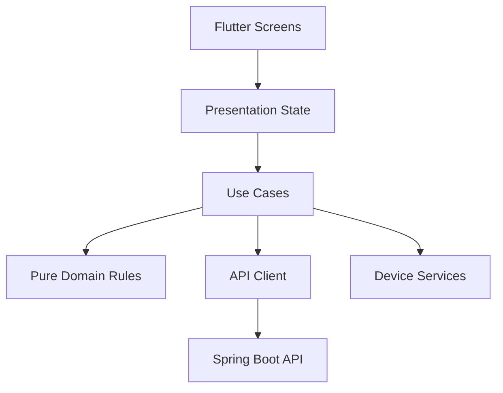

# Mobile Architecture

## Runtime Map

## Boundaries

- Presentation: widgets, navigation, loading/error/empty states.
- Application: use-case coordination and state transitions.
- Domain: GPA, graduation criteria, timetable conflicts, and recommendation rules.
- Infrastructure: HTTP client, secure storage, OCR/file, location, push notifications.

Keep platform plugins and HTTP models at infrastructure boundaries. Do not put business rules in widget `build` methods.

## Entry Point

`lib/main.dart`
