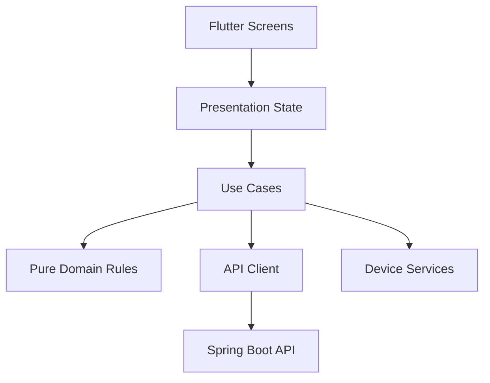

# Mobile Architecture

## Runtime Map

## Boundaries

- `lib/app`: root composition and navigation wiring.
- `lib/core`: shared configuration and future API, secure-storage, and device adapters. It never imports feature code.
- `lib/features/*/presentation`: widgets, navigation, loading/error/empty states.
- `lib/features/*/application`: use-case coordination and state transitions.
- `lib/features/*/domain`: pure GPA, graduation criteria, timetable conflict, and recommendation rules. It imports neither Flutter nor presentation code.

Keep platform plugins and HTTP models at infrastructure boundaries. Do not put business rules in widget `build` methods.

The backend OpenAPI snapshot under `contracts` is the only network contract. Mobile code never connects to Supabase PostgreSQL directly, and future tokens are stored through a `core` secure-storage adapter.

## Entry Point

`lib/main.dart`
